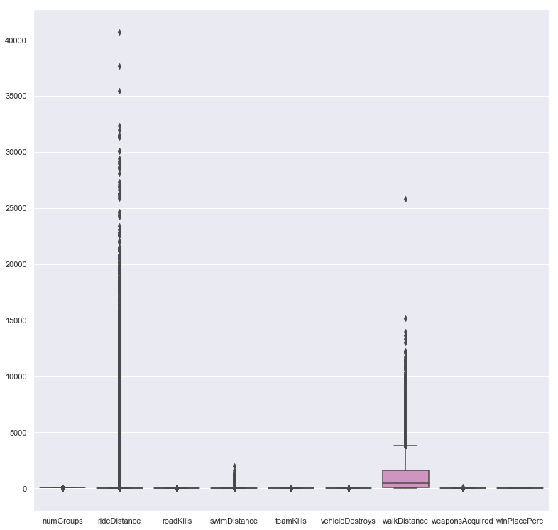
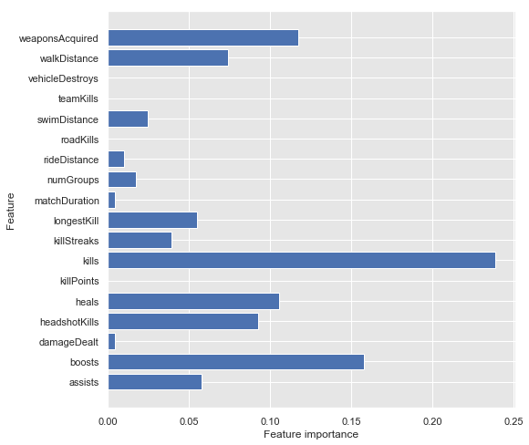
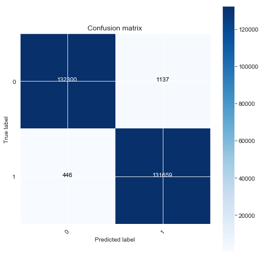

##  Introduction
Player Unknown's Battlegrounds (PUBG) is an online multiplayer Battle Roayale style "shooter" game. The game was developed and published by PUBG corporation, a subsidy of Bluehole game company in South Korea. The game, inspired by a 2000 Japanese film "Battle Royale" was conceived in many iterations by Brendan Greene (a.k.a. Player Unknown). The game was first released via PC in Beta format in March 2017, with a full PC release in December of the same year. The game was quickly converted to play on console with the XBox in September of 2018, and is now avaialble on Playstation and Nintendo as well as mobile versions in Android and iOS. The game is one of the most popular selling games of all time and has over 400 million players worldwide.

Battlegrounds is a player v player online match where up to 100 players can participate. Players can enter a match solo, duo (with one teammate) or in a squad of up to four players. The match starts with a players being parachuted from a plane over a map. The trajectory of the plane varies per match, so players must quickly decide when to eject to land at a selected location. Players are dropped without any weapons or gear, which is randomly placed around the entirety of the map. Players can search buildings, abandoned homes and industrial complexes to scavenge for protective gear, weapons, healing items and boosts (energy drink, painkillers) all while eliminating players they come across. The palyable area will begin to shrink and forces battle between leftover players. Also during the game, areas are bombed to also force continued movement of players. The goal is to eliminate all remaining players or teams and be the last standing. The reward is the title of "winner, winner chicken dinner".

As the battle royale format of play has become extremely popular, competition has become fierce. Direct cpompetitors such as Fortnite and Apex Legends have mirrored the style of play while developing their own niches. Major game developers have also realized this popularity and have released battle royale modes for such popular titles as Call of Duty (Infinity Ward) and Battlefield (DICE). Fortnite seems to be the direct competitor to PUBG, with a vast following and availability on PC, console and mobile formats.

The current landscape of competitiveness in this style of game has been content. As many of these games were released free or at an extrelmely reduced rate, content is where money is generated and interest is kept. New weapons, maps, equipment and character customizations have been what is steadily keeping these products in the consumers' minds. Leaderboard placement and winning is also important to those players with a vested commitment to the game. It is with this that we will take a look to see which, if any particular features in the PUBG game attribute to placing 1st (winning) the match. This may open insights to what aspects of the game may need reinforced or improved upon.

##  Dataset¶
The dataset was obtained from a Kaggle dataset that was put in place by the publisher for a competition to determine the winner of a match using the features provided. There is a training and test dataset. The training dataset comes with 4.45 million observations separated into 29 columns. The test dataset comprises 1.34 million observations and 28 columns (target column removed).

- DBNOs - Number of enemy players knocked. (incapacitated but not killed)
- assists - Number of enemy players this player damaged that were killed by teammates.
- boosts - Number of boost items used.
- damageDealt - Total damage dealt. Note: Self inflicted damage is subtracted.
- headshotKills - Number of enemy players killed with headshots.
- heals - Number of healing items used.
- Id - Player’s Id
- killPlace - Ranking in match of number of enemy players killed.
- killPoints - Kills-based external ranking of player. (Think of this as an Elo ranking where only kills matter.) If there is a value other than -1 in rankPoints, then any 0 in killPoints should be treated as a “None”.
- killStreaks - Max number of enemy players killed in a short amount of time.
- kills - Number of enemy players killed.
- longestKill - Longest distance between player and player killed at time of death. This may be misleading, as downing a player and driving away may lead to a large longestKill stat.
- matchDuration - Duration of match in seconds.
- matchId - ID to identify match. There are no matches that are in both the training and testing set.
- matchType - String identifying the game mode that the data comes from. The standard modes are “solo”, “duo”, “squad”, “solo-fpp”, “duo-fpp”, and “squad-fpp”; other modes are from events or custom matches.
- rankPoints - Elo-like ranking of player. This ranking is inconsistent and is being deprecated in the API’s next version, so use with caution. Value of -1 takes place of “None”.
- revives - Number of times this player revived teammates.
- rideDistance - Total distance traveled in vehicles measured in meters.
- roadKills - Number of kills while in a vehicle.
- swimDistance - Total distance traveled by swimming measured in meters.
- teamKills - Number of times this player killed a teammate.
- vehicleDestroys - Number of vehicles destroyed.
- walkDistance - Total distance traveled on foot measured in meters.
- weaponsAcquired - Number of weapons picked up.
- winPoints - Win-based external ranking of player. (Think of this as an Elo ranking where only winning matters.) If there is a value other than -1 in rankPoints, then any 0 in winPoints should be treated as a “None”.
- groupId - ID to identify a group within a match. If the same group of players plays in different matches, they will have a different groupId each time.
numGroups - Number of groups we have data for in the match.
maxPlace - Worst placement we have data for in the match. This may not match with numGroups, as sometimes the data skips over placements.
winPlacePerc - The target of prediction. This is a percentile winning placement, where 1 corresponds to 1st place, and 0 corresponds to last place in the match. It is calculated off of maxPlace, not numGroups, so it is possible to have missing chunks in a match.

## Highlights

### 0s in Data
At first glance, there are alot of 0s that is going to be prevalent in the dataset. This is due to the nature of the game where there is a high rate of kills within the first few minutes of the match. Many players will land in the same areas. Immediate kills lead to 0s in their match. With many features having the min, 25%, 50% and 75% quantiles at 0, this is going to be a pretty imbalanced dataset with some significant outliers to the data. This can be handled by SMOTE, which we can implement after we split the data into features and target.
### Outliers
There are some significant outliers regarding longest kill and damage dealt. Before I standardize the data, I want to take care of as many outliers as possible without losing too much data. Removing data will stay at or below 1% of total data for each feature with significant outliers.

### Feature Importance
The consensus for the models is that around 8 features account for about 90% of the data.

## Results

### Model used - XGBoostClassifier with tuned hyperparameters

### Training Accuracy: 99.4%
### Validation accuracy: 99.4%

## Conclusion
The goal of this project was to determine what, if any, features can predict a win in the game of Player Unknown's Battlegrounds to uncover some business insights into this ultra-competitive market. Since different features would benefit certain match types over others, the data was separated into solo, duo and squad matchtypes.

After initial observation of the PUBG dataset, it was determined that while the dataset was large and clean, it was also imbalanced. Values leaned towards the 0 value. Further scrubbing was performed by removing features that showed collinearity towards other features, was classifying data and had no useable data to incorporate. SMOTE was performed to handle the imbalanced data and the data was scaled.

Logistic Regression, Random Forest and XGBoost models were utilized to predict the target. The initial models performed did show promise, as accuracy in our training and test results for all models were in the high 90% range. It was detremined that additional features could be removed to reduce noise. Features were ranked by model, resampled for balance again and scaled. Also, hyperparameter tuning was performed on the updated data for each model via GridSearch.

As a result, the Logistic Regression model did lose a little accuracy, but the prediction power was greatly improved. The Random Forest model showed similar results, with accuracy being slightly reduced, but True Positive prediction increased. The model that showed the greatest improvement via tuning and feature reduction was the XGBoost model. Accuracy improved in both training and test sets as well as the predictive power of the model.

It is recommended that this data be revisted and models tested for the duo matches and squad matches as well. Also, the Random Forest model outperformed the XGBoost model in the initial run. This may validate further investigation into feature selection and tuning for that particular model.
